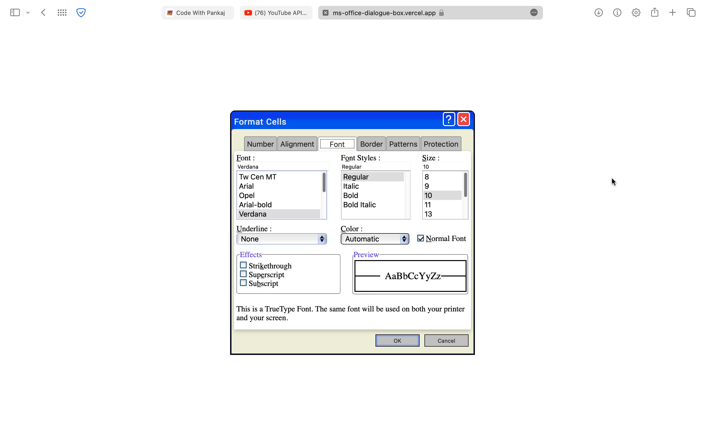

# MS Office Dialogue Box

The repository contains custom CSS that I designed to create a ms office dialogue box that can be accessed by users with "access keys" for devices.

## Features

 *** <ins>ACCESS KEY'S FOR MAC</ins> ***

OPT + CTRL + F => FONT<br />
OPT + CTRL + O => FONT STYLE<br />
OPT + CTRL + S => FONT SIZE<br />
OPT + CTRL + U => UNDERLINE<br />
OPT + CTRL + C => COLOR<br />
OPT + CTRL + N => NORMAL FONT (CHECKED / UNCHECKED)<br />
OPT + CTRL + K => STRIKETHROUGH (CHECKED / UNCHECKED)<br />
OPT + CTRL + E => SUPERSCRIPT(CHECKED / UNCHECKED)<br />
OPT + CTRL + B => SUBSCRIPT(CHECKED / UNCHECKED)<br />


*** <ins>ACCESS KEY'S FOR WINDOWS</ins> ***

ALT + F => FONT<br />
ALT + O => FONT STYLE<br />
ALT + S => FONT SIZE<br />
ALT + U => UNDERLINE<br />
ALT + C => COLOR<br />
ALT + N => NORMAL FONT (CHECKED / UNCHECKED)<br />
ALT + K => STRIKETHROUGH (CHECKED / UNCHECKED)<br />
ALT + E => SUPERSCRIPT(CHECKED / UNCHECKED)<br />
ALT + B => SUBSCRIPT(CHECKED / UNCHECKED)<br />


## Authors

- [@PankajBaliyan](https://www.github.com/PankajBaliyan)


## Contributing

Contributions are always welcome!

See `index.html` for ways to get started.

Please adhere to this project's `code of conduct`.


## Demo

https://ms-office-dialogue-box.vercel.app
<br><br>
https://PankajBaliyan.github.io/MS-Office-Dialogue-Box/


## Feedback

If you have any feedback, please reach out to us at pankajbaliyan90@gmail.com


## 🔗 Links
[](https://codewithpankaj.vercel.app)

[](https://www.linkedin.com/in/pankaj-kumar-90/)

## Lessons Learned

I learned many things while making this repository, i.e. how to make a webpage responsive to all devices screens and how to apply custom css to make pretty & cool screens.
## Run Locally

Clone the project

```bash
  git clone https://github.com/PankajBaliyan/MS-Office-Dialogue-Box.git
```

Go to the project directory

```bash
  cd my-project
```

Start code editor

```bash
  code .
```


## Screenshots




## Support

For support, email pankajbaliyan90@gmail.com or join our Slack channel.

